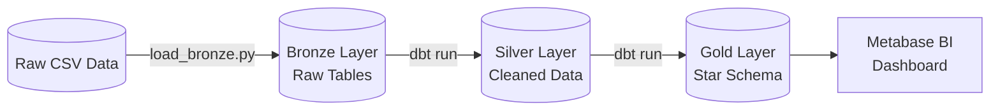
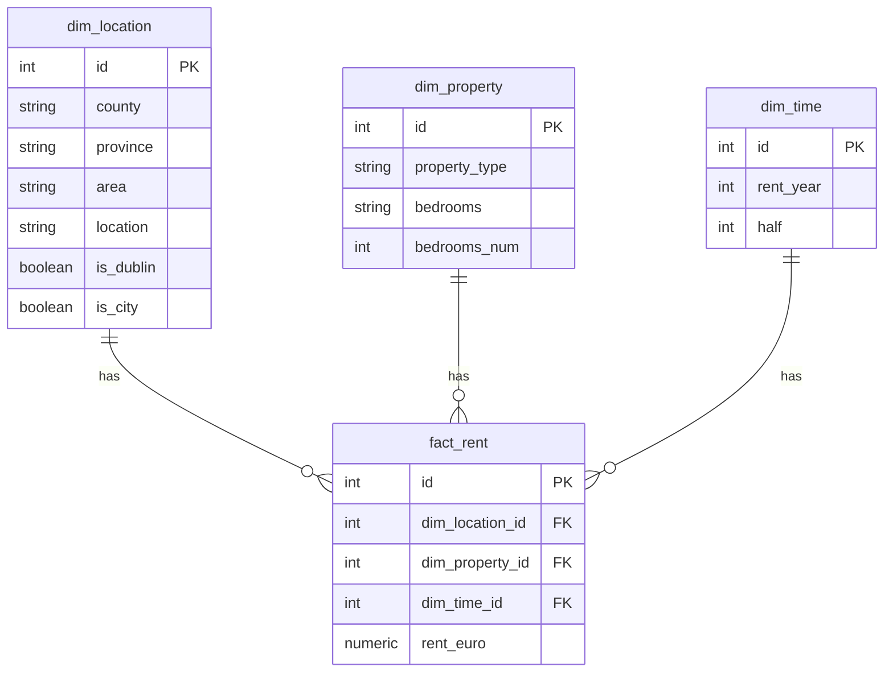
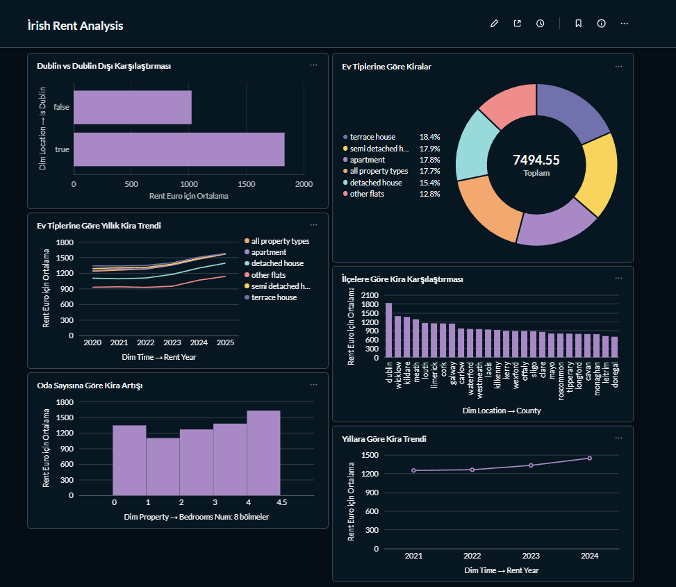
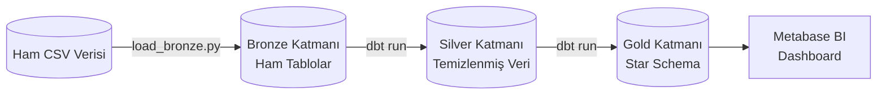

# 🇮🇪 Irish Rent Analysis Pipeline (End-to-End Data Engineering)

An end-to-end Data Engineering and Business Intelligence project that analyzes the Irish rental market. The pipeline extracts raw CSV data, transforms it using a **Medallion Architecture (Bronze -> Silver -> Gold)**, ensures data quality via automated tests, orchestrates the workflow with **Prefect**, and visualizes the results on a **Metabase** dashboard.

---

<h2>🇬🇧 English Documentation</h2>

### 🏗️ Architecture & Tech Stack
- **Data Source**: Irish Rent Prices Dataset (CSV)
- **Database**: PostgreSQL (Containerized via Docker)
- **Orchestration**: Prefect (Python)
- **Transformation & Testing**: dbt (Data Build Tool)
- **Data Modeling**: Medallion Architecture & Star Schema (Fact & Dimensions)
- **BI / Visualization**: Metabase
- **Idempotency**: Handled natively by dbt (`TRUNCATE` and `INSERT`)

### ⚙️ Data Pipeline (Medallion Architecture)

1. **Bronze Layer (Raw Data)**: Python script (`load_bronze.py`) utilizes `execute_values` for high-performance bulk insertion.
2. **Silver Layer (Cleansed Data)**: **dbt** models clean the data, normalize columns, and remove duplicates.
3. **Gold Layer (Star Schema)**: **dbt** models transform the cleansed data into a Star Schema for analytical reporting.
4. **Data Quality Audits**: **dbt test** automatically validates referential integrity, null constraints, and uniqueness at the end of the pipeline.

### 🗄️ Data Model (Star Schema)

### 📊 The Dashboard
*A comprehensive view of the Irish rental market, visualizing price trends, county disparities, and property type distributions.*

  

### 🚀 How to Run
1. **Start the Infrastructure**: `docker-compose up -d`
2. **Install Dependencies**: `pip install -r requirements.txt`
3. **Run the ETL Pipeline**: `python run_pipeline.py`
4. **View Dashboards**: Open `http://localhost:3000` to access Metabase.

<h2>🇹🇷 Türkçe Dokümantasyon</h2>

İrlanda kiralık ev piyasasını analiz eden, uçtan uca bir Veri Mühendisliği ve İş Zekası (BI) projesi. Bu boru hattı (pipeline); ham CSV verisini çeker, **Medallion Mimarisi (Bronze -> Silver -> Gold)** kullanarak dönüştürür, otomatik testlerle veri kalitesini sağlar, tüm iş akışını **Prefect** ile yönetir ve sonuçları **Metabase** panosu (dashboard) üzerinde görselleştirir.

### 🏗️ Mimari ve Teknolojiler
- **Veri Kaynağı**: İrlanda Kira Fiyatları Veriseti (CSV)
- **Veritabanı**: PostgreSQL (Docker ile çalışır)
- **Orkestrasyon**: Prefect (Python)
- **Dönüşüm ve Test (T)**: dbt (Data Build Tool)
- **Veri Modelleme**: Medallion Mimarisi & Star Schema (Fact ve Boyut Tabloları)
- **İş Zekası (BI)**: Metabase
- **Tekrarlanabilirlik (Idempotency)**: dbt tarafından otomatik sağlanır.

### ⚙️ Veri Boru Hattı (Medallion Mimarisi)

1. **Bronze Katmanı (Ham Veri)**: `load_bronze.py` dosyası, `execute_values` kullanarak devasa CSV verisini saniyeler içinde veritabanına yazar.
2. **Silver Katmanı (Temizlenmiş Veri)**: **dbt** modelleri (models) verileri temizler, standartlaştırır ve ayıklar.
3. **Gold Katmanı (Star Schema)**: **dbt** modelleri, temizlenen veriyi analitik raporlamaya uygun olarak Fact ve Dimension (Boyut) tablolarına böler.
4. **Veri Kalitesi Testleri**: Pipeline'ın en sonunda **dbt test** çalışarak verinin doğruluğunu (Referential Integrity, Null checks) otomatik olarak denetler.

### 🗄️ Veri Modeli (Star Schema)

### 📊 Raporlama ve Pano (Dashboard)
*İrlanda kiralık ev piyasasının kapsamlı bir özeti; fiyat trendleri, bölgesel farklar ve ev tipi dağılımları.*

  

### 🚀 Nasıl Çalıştırılır?
1. **Altyapıyı Başlatın**: `docker-compose up -d`
2. **Gereksinimleri Yükleyin**: `pip install -r requirements.txt`
3. **ETL Sürecini (Pipeline) Başlatın**: `python run_pipeline.py`
4. **Raporları Görüntüleyin**: Metabase paneline erişmek için tarayıcınızda `http://localhost:3000` adresine gidin.

