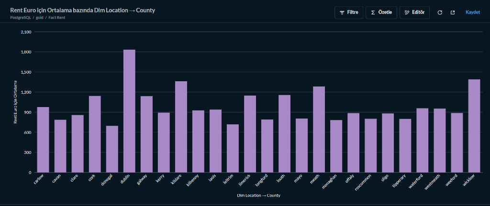
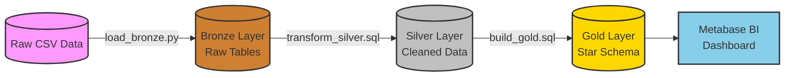
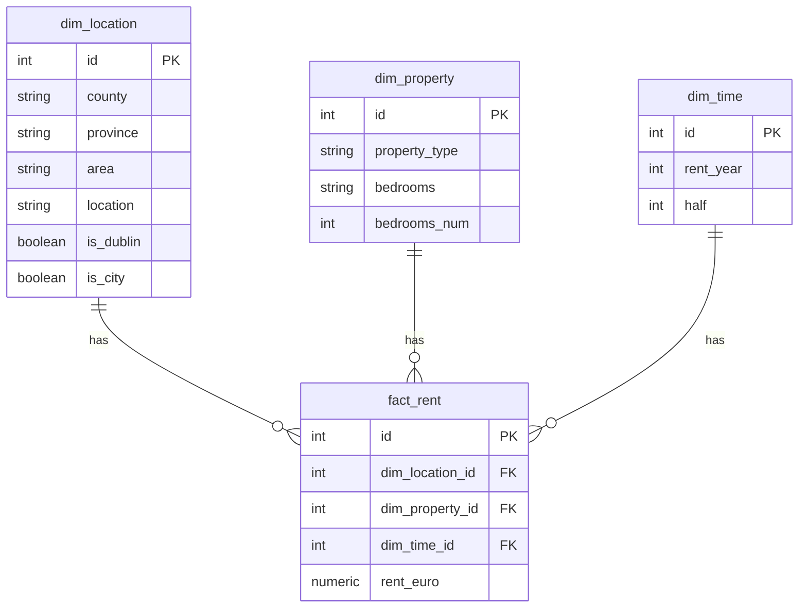

# 🇮🇪 Irish Rent Analysis Pipeline (End-to-End Data Engineering)

[](https://www.python.org/)
[](https://www.postgresql.org/)
[](https://www.docker.com/)
[](https://www.prefect.io/)
[](https://www.metabase.com/)

An end-to-end Data Engineering and Business Intelligence project that analyzes the Irish rental market. The pipeline extracts raw CSV data, transforms it using a **Medallion Architecture (Bronze -> Silver -> Gold)**, ensures data quality via automated tests, orchestrates the workflow with **Prefect**, and visualizes the results on a **Metabase** dashboard.

[🇹🇷 Türkçe açıklamayı aşağıda bulabilirsiniz.](#-türkçe-açıklama)

## 🏗️ Architecture & Tech Stack

- **Data Source**: Irish Rent Prices Dataset (CSV)
- **Database**: PostgreSQL (Containerized via Docker)
- **Orchestration**: Prefect (Python)
- **Data Modeling**: Medallion Architecture & Star Schema (Fact & Dimensions)
- **BI / Visualization**: Metabase
- **Idempotency**: Handled via `TRUNCATE` and `ON CONFLICT DO NOTHING`

## 📊 The Dashboard
*A comprehensive view of the Irish rental market, visualizing price trends, county disparities, and property type distributions.*



## ⚙️ Data Pipeline (Medallion Architecture)



1. **Bronze Layer (Raw Data)**: Python script (`load_bronze.py`) utilizes `psycopg2.extras.execute_values` for high-performance bulk insertion of raw CSV data into PostgreSQL.
2. **Silver Layer (Cleansed Data)**: SQL transformations (`transform_silver.sql`) clean the data, normalize columns, and remove duplicates.
3. **Gold Layer (Star Schema)**: SQL scripts (`build_gold.sql`) model the cleansed data into a Star Schema (`fact_rent`, `dim_location`, `dim_property`, `dim_time`) for analytical reporting.
4. **Data Quality Audits**: Automated SQL scripts (`tests/`) run integrity checks at the end of the pipeline to ensure data validity.

## 🚀 How to Run

1. **Start the Infrastructure**:
   ```bash
   docker-compose up -d
   ```
2. **Install Dependencies**:
   ```bash
   pip install -r requirements.txt
   ```
3. **Run the ETL Pipeline**:
   ```bash
   python run_pipeline.py
   ```
4. **View Dashboards**: Open `http://localhost:3000` to access Metabase.

---

# 🇹🇷 Türkçe Açıklama

İrlanda kiralık ev piyasasını analiz eden, uçtan uca bir Veri Mühendisliği ve İş Zekası (BI) projesi. Bu boru hattı (pipeline); ham CSV verisini çeker, **Medallion Mimarisi (Bronze -> Silver -> Gold)** kullanarak dönüştürür, otomatik testlerle veri kalitesini sağlar, tüm iş akışını **Prefect** ile yönetir ve sonuçları **Metabase** panosu (dashboard) üzerinde görselleştirir.

## 🏗️ Mimari ve Teknolojiler

- **Veri Kaynağı**: İrlanda Kira Fiyatları Veriseti (CSV)
- **Veritabanı**: PostgreSQL (Docker ile çalışır)
- **Orkestrasyon**: Prefect (Python)
- **Veri Modelleme**: Medallion Mimarisi & Star Schema (Fact ve Boyut Tabloları)
- **İş Zekası (BI)**: Metabase
- **Tekrarlanabilirlik (Idempotency)**: `TRUNCATE` ve `ON CONFLICT DO NOTHING` ile sağlanmıştır.

## ⚙️ Veri Boru Hattı (Medallion Mimarisi)



1. **Bronze Katmanı (Ham Veri)**: `load_bronze.py` dosyası, `execute_values` (Bulk Insert) kullanarak devasa CSV verisini saniyeler içinde veritabanına yazar.
2. **Silver Katmanı (Temizlenmiş Veri)**: Veriler temizlenir, standartlaştırılır ve SQL ile ayıklanır (`transform_silver.sql`).
3. **Gold Katmanı (Star Schema)**: Temizlenen veri, analitik raporlamaya uygun olarak Fact ve Dimension (Boyut) tablolarına ayrılır (`build_gold.sql`).
4. **Veri Kalitesi Testleri**: Pipeline'ın en sonunda çalışan SQL testleri (`tests/`), verinin doğruluğunu ve eksiksiz olduğunu denetler.

## 🚀 Nasıl Çalıştırılır?

1. **Altyapıyı Başlatın**:
   ```bash
   docker-compose up -d
   ```
2. **Gereksinimleri Yükleyin**:
   ```bash
   pip install -r requirements.txt
   ```
3. **ETL Sürecini (Pipeline) Başlatın**:
   ```bash
   python run_pipeline.py
   ```
4. **Raporları Görüntüleyin**: Metabase paneline erişmek için tarayıcınızda `http://localhost:3000` adresine gidin.
