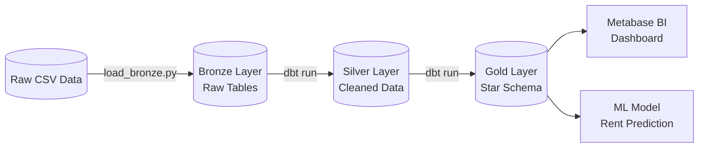
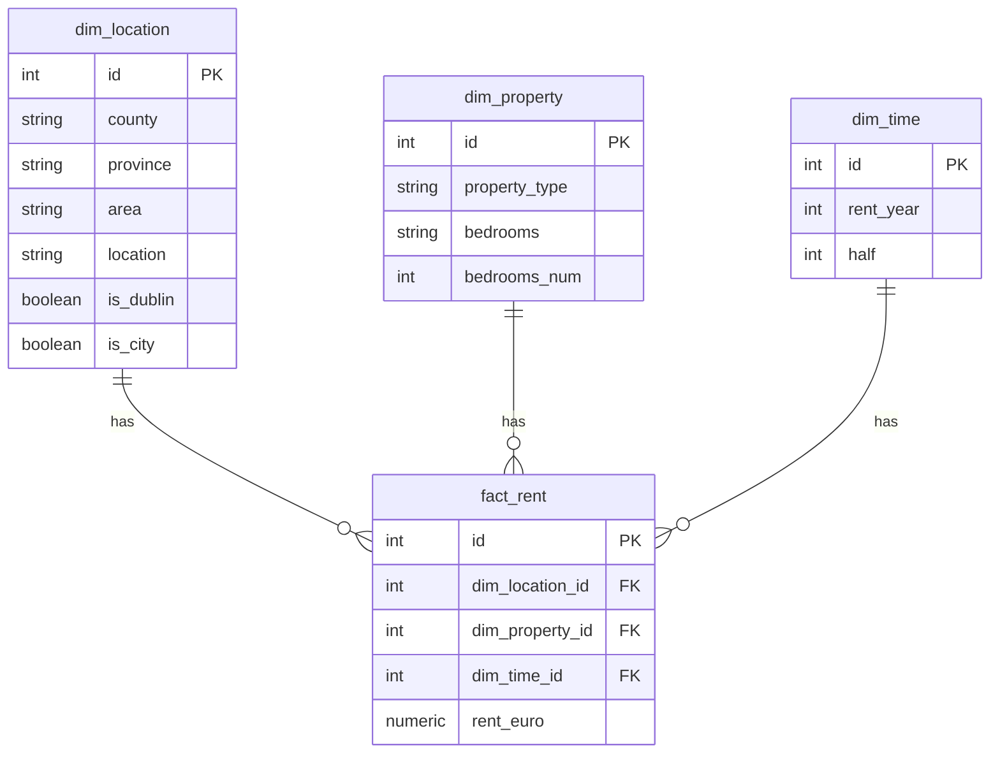
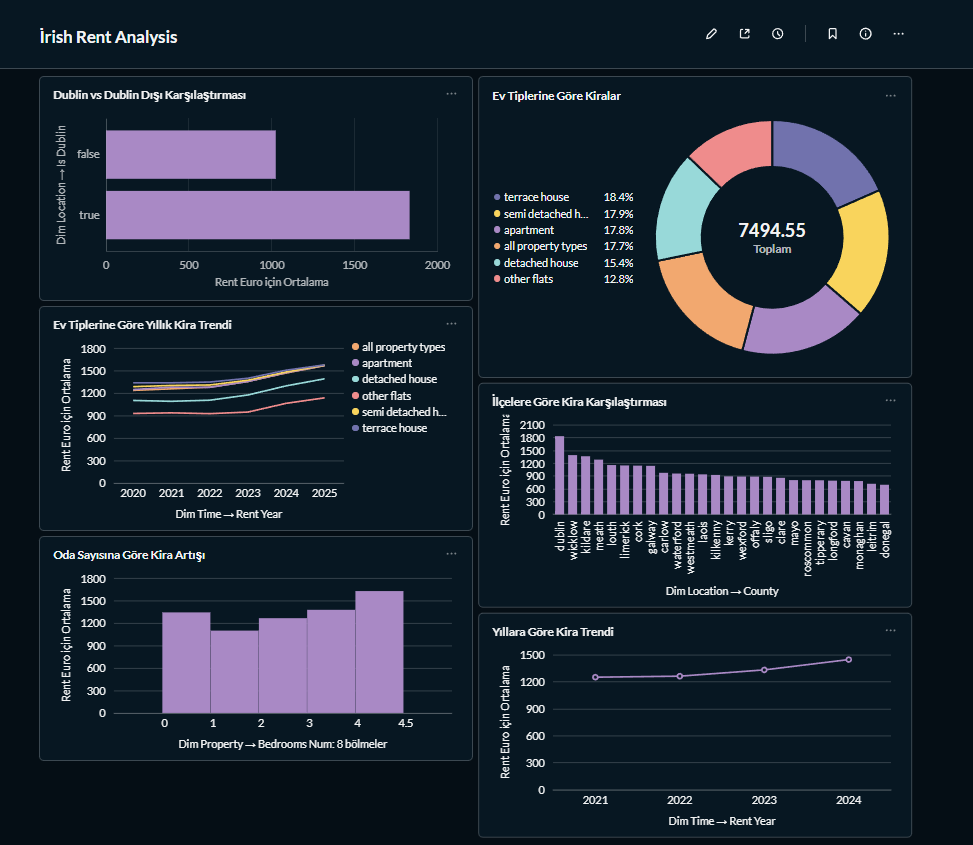
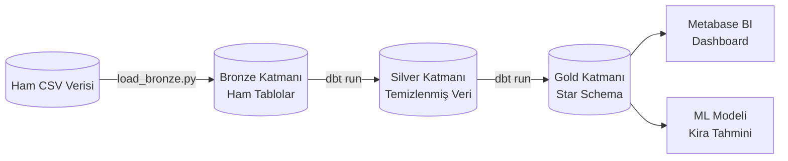

# 🇮🇪 Irish Rent Analysis — End-to-End Data Engineering & ML Project

[](https://www.python.org/)
[](https://www.postgresql.org/)
[](https://www.docker.com/)
[](https://www.prefect.io/)
[](https://www.getdbt.com/)
[](https://scikit-learn.org/)
[](https://www.metabase.com/)

An **end-to-end Data Engineering and Machine Learning** project that analyzes the Irish rental market. The pipeline extracts raw CSV data, transforms it using **Medallion Architecture (Bronze → Silver → Gold)**, validates data quality with automated tests, orchestrates the workflow with **Prefect**, visualizes insights on a **Metabase** dashboard, and predicts rental prices using a **Random Forest** machine learning model.

---

<details open>
<summary><h2>🇬🇧 English Documentation</h2></summary>

### 🏗️ Architecture & Tech Stack

| Layer | Technology | Purpose |
|---|---|---|
| Data Source | CSV | Irish Rent Prices Dataset |
| Database | PostgreSQL (Docker) | Data storage |
| Orchestration | Prefect | Pipeline scheduling & monitoring |
| Transformation & Testing | dbt (Data Build Tool) | Data modeling & quality |
| Data Modeling | Medallion Architecture + Star Schema | Analytical reporting |
| Exploratory Analysis | Pandas, Matplotlib, Seaborn | EDA & visualization |
| Machine Learning | scikit-learn (Random Forest) | Rent price prediction |
| BI / Visualization | Metabase | Interactive dashboards |

---

### ⚙️ Data Pipeline (Medallion Architecture)


```mermaid
graph LR
    A[(Raw CSV Data)] -->|load_bronze.py| B[(Bronze Layer<br/>Raw Tables)]
    B -->|dbt run| C[(Silver Layer<br/>Cleaned Data)]
    C -->|dbt run| D[(Gold Layer<br/>Star Schema)]
    D --> E[Metabase BI<br/>Dashboard]
    D --> F[ML Model<br/>Rent Prediction]
```

1. **Bronze Layer (Raw Data)**: `load_bronze.py` uses `execute_values` for high-performance bulk insertion of the raw CSV.
2. **Silver Layer (Cleansed Data)**: dbt models clean, normalize, and deduplicate the data.
3. **Gold Layer (Star Schema)**: dbt models transform cleansed data into a Star Schema for analytical reporting.
4. **Data Quality Audits**: `dbt test` automatically validates referential integrity, null constraints, and uniqueness.

---

### 🗄️ Data Model (Star Schema)


```mermaid
erDiagram
    fact_rent {
        int id PK
        int dim_location_id FK
        int dim_property_id FK
        int dim_time_id FK
        numeric rent_euro
    }
    dim_location {
        int id PK
        string county
        string province
        string area
        string location
        boolean is_dublin
        boolean is_city
    }
    dim_property {
        int id PK
        string property_type
        string bedrooms
        int bedrooms_num
    }
    dim_time {
        int id PK
        int rent_year
        int half
    }
    
    dim_location ||--o{ fact_rent : "has"
    dim_property ||--o{ fact_rent : "has"
    dim_time ||--o{ fact_rent : "has"
```

---

### 📊 Exploratory Data Analysis (EDA)

Key findings from `notebooks/01_eda.ipynb`:

- 📈 **Price Trend**: Rents have been rising continuously — with a sharp acceleration in recent years.
- 🏙️ **Dublin Premium**: Dublin rents are ~€800/month higher than the rest of Ireland on average.
- 🏠 **Property Types**: Detached houses command the highest average rents; apartments are the most common listing.
- 💶 **Price Distribution**: The majority of listings fall in the €1,000–€1,500/month band.

---

### 🤖 Machine Learning — Rent Price Prediction

Implemented in `notebooks/02_ml_model.ipynb` using a **Random Forest Regressor**.

**Pipeline:**
1. **One-Hot Encoding** — Converts categorical `property_type` to numeric columns (0/1).
2. **Train/Test Split** — 80% training, 20% testing.
3. **Model Training** — `RandomForestRegressor` with 300 estimators.
4. **Evaluation** — MAE and R² score on unseen test data.

**Results:**

| Metric | Value | Meaning |
|---|---|---|
| MAE | ±215 Euro | Average prediction error per listing |
| R² Score | ~72.8% | Model explains ~73% of price variance |

**Example Predictions:**
```python
# "What would rent cost for a 3-bedroom apartment in Dublin in 2025?"
kira_tahmin_et(yil=2025, oda_sayisi=3, dublin_mi=True, ev_tipi="apartment")
# → ~€2,100/month
```

---

### 📊 The Dashboard

*A comprehensive view of the Irish rental market — price trends, county disparities, and property type distributions.*

<div align="center">
  
</div>

---

### 🚀 How to Run

1. **Start the Infrastructure**:
   ```bash
   docker-compose up -d
   ```

2. **Install Dependencies**:
   ```bash
   pip install -r requirements.txt
   ```

3. **Run the ETL Pipeline**:
   ```bash
   python run_pipeline.py
   ```

4. **View Dashboards**: Open [http://localhost:3000](http://localhost:3000) in your browser.

5. **Run Notebooks**:
   - `notebooks/01_eda.ipynb` → Exploratory Data Analysis
   - `notebooks/02_ml_model.ipynb` → Machine Learning & Rent Prediction

</details>

---

<details>
<summary><h2>🇹🇷 Türkçe Dokümantasyon</h2></summary>

İrlanda kiralık ev piyasasını analiz eden **uçtan uca (End-to-End) bir Veri Mühendisliği ve Makine Öğrenmesi** projesi. Pipeline; ham CSV verisini çeker, **Medallion Mimarisi (Bronze → Silver → Gold)** kullanarak dönüştürür, otomatik testlerle veri kalitesini sağlar, tüm iş akışını **Prefect** ile yönetir, sonuçları **Metabase** panosunda görselleştirir ve **Random Forest** algoritmasıyla kira tahmini yapar.

---

### 🏗️ Mimari ve Teknolojiler

| Katman | Teknoloji | Amaç |
|---|---|---|
| Veri Kaynağı | CSV | İrlanda Kira Fiyatları Verisi |
| Veritabanı | PostgreSQL (Docker) | Veri depolama |
| Orkestrasyon | Prefect | Pipeline yönetimi ve izleme |
| Dönüşüm & Test | dbt (Data Build Tool) | Veri modelleme ve kalite kontrol |
| Veri Modelleme | Medallion Mimarisi + Star Schema | Analitik raporlama |
| Keşifçi Analiz | Pandas, Matplotlib, Seaborn | EDA ve görselleştirme |
| Makine Öğrenmesi | scikit-learn (Random Forest) | Kira tahmini |
| İş Zekası (BI) | Metabase | Etkileşimli panolar |

---

### ⚙️ Veri Boru Hattı (Medallion Mimarisi)


```mermaid
graph LR
    A[(Ham CSV Verisi)] -->|load_bronze.py| B[(Bronze Katmanı<br/>Ham Tablolar)]
    B -->|dbt run| C[(Silver Katmanı<br/>Temizlenmiş Veri)]
    C -->|dbt run| D[(Gold Katmanı<br/>Star Schema)]
    D --> E[Metabase BI<br/>Dashboard]
    D --> F[ML Modeli<br/>Kira Tahmini]
```

1. **Bronze Katmanı (Ham Veri)**: `load_bronze.py`, `execute_values` kullanarak büyük CSV'yi hızla veritabanına yazar.
2. **Silver Katmanı (Temizlenmiş Veri)**: dbt modelleri veriyi temizler, standartlaştırır ve tekilleştirir.
3. **Gold Katmanı (Star Schema)**: dbt modelleri, temizlenen veriyi Fact ve Dimension (Boyut) tablolarına böler.
4. **Veri Kalitesi Testleri**: `dbt test` ile referential integrity, null check ve uniqueness otomatik denetlenir.

---

### 🗄️ Veri Modeli (Star Schema)


```mermaid
erDiagram
    fact_rent {
        int id PK
        int dim_location_id FK
        int dim_property_id FK
        int dim_time_id FK
        numeric rent_euro
    }
    dim_location {
        int id PK
        string county
        string province
        string area
        string location
        boolean is_dublin
        boolean is_city
    }
    dim_property {
        int id PK
        string property_type
        string bedrooms
        int bedrooms_num
    }
    dim_time {
        int id PK
        int rent_year
        int half
    }
    
    dim_location ||--o{ fact_rent : "has"
    dim_property ||--o{ fact_rent : "has"
    dim_time ||--o{ fact_rent : "has"
```

---

### 📊 Keşifçi Veri Analizi (EDA)

`notebooks/01_eda.ipynb` dosyasındaki temel bulgular:

- 📈 **Fiyat Trendi**: Kiralar sürekli artıyor — son yıllarda ivme belirgin şekilde yükseldi.
- 🏙️ **Dublin Farkı (Dublin Premium)**: Dublin kiraları, İrlanda ortalamasının ortalama ~€800/ay üzerinde.
- 🏠 **Ev Tipleri**: Müstakil evler en yüksek ortalama kiraya sahip; apartmanlar en yaygın ilan türü.
- 💶 **Fiyat Dağılımı**: İlanların büyük çoğunluğu €1.000–€1.500/ay bandında yoğunlaşıyor.

---

### 🤖 Makine Öğrenmesi — Kira Tahmini

`notebooks/02_ml_model.ipynb` dosyasında **Random Forest Regressor** kullanılarak uygulandı.

**Süreç:**
1. **One-Hot Encoding** — `property_type` gibi kategorik verileri 0/1 sayısal sütunlara çevir.
2. **Train/Test Bölme** — %80 eğitim, %20 test.
3. **Model Eğitimi** — 300 ağaçlı `RandomForestRegressor`.
4. **Değerlendirme** — Hiç görmediği test verisiyle MAE ve R² hesapla.

**Sonuçlar:**

| Metrik | Değer | Anlamı |
|---|---|---|
| MAE | ±215 Euro | Her tahmin için ortalama hata payı |
| R² Skoru | ~%72.8 | Model, kira fiyat varyansının ~%73'ünü açıklıyor |

**Örnek Tahmin:**
```python
# "2025 yılında, Dublin'de, 3 odalı bir apartmanın kirası ne kadar olur?"
kira_tahmin_et(yil=2025, oda_sayisi=3, dublin_mi=True, ev_tipi="apartment")
# → ~€2.100/ay
```

---

### 📊 Raporlama ve Pano (Dashboard)

*İrlanda kiralık ev piyasasının kapsamlı özeti; fiyat trendleri, bölgesel farklar ve ev tipi dağılımları.*

<div align="center">
  
</div>

---

### 🚀 Nasıl Çalıştırılır?

1. **Altyapıyı Başlatın**:
   ```bash
   docker-compose up -d
   ```

2. **Gereksinimleri Yükleyin**:
   ```bash
   pip install -r requirements.txt
   ```

3. **ETL Pipeline'ı Çalıştırın**:
   ```bash
   python run_pipeline.py
   ```

4. **Panoyu Görüntüleyin**: Tarayıcınızda [http://localhost:3000](http://localhost:3000) adresine gidin.

5. **Notebook'ları Çalıştırın**:
   - `notebooks/01_eda.ipynb` → Keşifçi Veri Analizi
   - `notebooks/02_ml_model.ipynb` → Makine Öğrenmesi & Kira Tahmini

</details>
